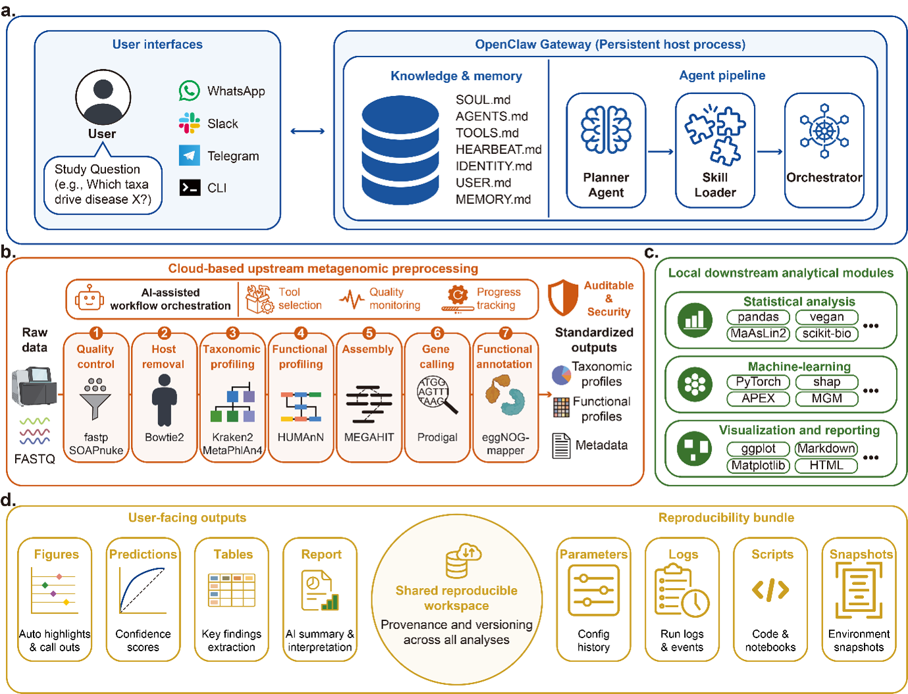

# MetaClaw

**An auditable AI agent for end-to-end, multi-directional shotgun metagenomic analysis**

MetaClaw is a reproducible-agent framework that turns raw shotgun metagenomic reads into publication-ready statistical results, figures, and reports, while keeping every parameter, script, container, and intermediate file available for independent audit. Rather than an open-ended, code-generating chat assistant, MetaClaw constrains an LLM to a gateway role: it selects pipelines, adapts analysis scripts to a given cohort, and orchestrates execution — but it never sees raw sequencing reads and never runs unconstrained code.

MetaClaw is built on [OpenClaw](https://docs.openclaw.ai/) and couples a deterministic cloud-hosted **upstream** stage (quality control, taxonomic/functional profiling, assembly — run on [FlowHub](https://doc.flowhub.com.cn/ch/) via the `fkit` CLI) with a flexible, containerized local **downstream** stage (statistics, machine learning, visualization, reporting) built from composable **skills**. The two stages are connected by a single YAML pipeline registry and a shared, self-documenting per-job workspace.

We evaluated MetaClaw by reproducing four published shotgun-metagenomic studies end to end — a sorghum rhizosphere drought-stress study, an RRMS saliva microbiome–metabolome study, a colorectal cancer stool metagenome biomarker study, and a permafrost thaw-gradient microbiome–metabolome study — and by stress-testing its scaffolding across LLM backends, prompt specificity, noisy mixed-study inputs, and targeted ablation of individual scaffold layers (planning, reference scripts, pipeline registry, manifest hand-off).

> This repository accompanies the manuscript *"MetaClaw: an auditable AI agent for end-to-end, multi-directional shotgun metagenomic analysis"* (manuscript in preparation). Source code, the pipeline registry, skill definitions, and container build files are provided here; benchmark inputs referenced in the manuscript are listed under [`data/`](data/).

<p align="center">
  
</p>

<p align="center"><b>Figure 1. MetaClaw system overview.</b>
(a) User-facing chat clients connect to a persistent OpenClaw gateway, whose native workspace files (<code>SOUL.md</code>, <code>AGENTS.md</code>, <code>TOOLS.md</code>, <code>HEARTBEAT.md</code>, <code>IDENTITY.md</code>, <code>USER.md</code>, <code>MEMORY.md</code>) drive a Planner Agent, Skill Loader, and Orchestrator.
(b) Cloud-based upstream metagenomic preprocessing — QC, host-read removal, taxonomic and functional profiling, and assembly — runs as versioned FlowHub flows reached through <code>fkit</code>; raw FASTQ never leaves FlowHub.
(c) Local downstream analytical modules — statistical analysis, machine-learning prediction, and visualization/reporting — run in pinned containers and are customized per job by the LLM.
(d) User-facing outputs (figures, predictions, tables, reports) and the reproducibility bundle (parameters, logs, scripts, containers) are written to a shared per-job workspace for full audit and rerun.</p>

---

## Contents

1. [Key design principles](#key-design-principles)
2. [System architecture](#system-architecture)
3. [Repository layout](#repository-layout)
4. [Requirements](#requirements)
5. [Installation](#installation)
6. [Quick start (toy data, no cloud account needed)](#quick-start-toy-data-no-cloud-account-needed)
7. [Running a full analysis](#running-a-full-analysis)
8. [Available pipelines](#available-pipelines)
9. [Available skills](#available-skills)
10. [Reproducibility](#reproducibility)
11. [Security and isolation](#security-and-isolation)
12. [Extending MetaClaw](#extending-metaclaw)
13. [Documentation index](#documentation-index)
14. [Citing MetaClaw](#citing-metaclaw)
15. [License](#license)

---

## Key design principles

- **Two execution domains, one contract.** Fixed, high-throughput tools (QC, host-read decontamination, taxonomic/functional profiling, assembly) run as versioned flows on FlowHub. Flexible, cohort-dependent analyses (statistics, ML, visualization, reporting) run in pinned local containers as OpenClaw **skills**. A single registry file (`registry/pipelines.yaml`) is the only coupling point between the two.
- **The LLM never touches raw data or unconstrained execution.** The language model operates only at the gateway layer: it plans, confirms parameter bindings with the user, and writes analysis scripts to disk. It never enters the FlowHub flow and never executes inside the downstream container — the container receives a pre-saved script file, not free-form instructions, closing the most common prompt-injection path into the analysis runtime.
- **Reference → customize → archive → execute.** Every downstream skill ships a read-only reference script. The LLM copies and rewrites it for the data at hand (column names, covariates, sample size); the customized copy — not the template — is what actually runs, and both are archived.
- **Plan → confirm → submit → poll → finalize.** Upstream jobs are never submitted blind. A dry-run "plan" phase resolves file→port bindings and flow defaults for user sign-off before any FlowHub compute is spent; a sentinel file gates downstream execution on a fully finalized upstream run.
- **Auditable by construction, not by convention.** Every job writes a self-contained `reproducibility/` folder: the resolved pipeline spec, FlowHub submission spec and poll snapshots, pinned Dockerfiles, verbatim `SKILL.md` snapshots, LLM-generated scripts, logs, and exit codes — everything needed for a third party to inspect or rerun the analysis.

## System architecture

See Figure 1 above for the illustrated overview. The equivalent text-form layout:

```
                     User / Chat Client
              (WhatsApp, Slack, Telegram, CLI …)
                            │
                            ▼
        ┌───────────────────────────────────────────┐
        │            OpenClaw Gateway                │
        │  SOUL · AGENTS · TOOLS · HEARTBEAT · MEMORY │
        │  Planner Agent → Skill Loader → Orchestrator│
        │         (LLM lives here — nowhere else)     │
        └──────────┬───────────────────┬──────────────┘
                   │                   │
       upstream: FlowHub cloud   downstream: local, long-running
       via `fkit` (plan/submit/  container (`docker exec` runs
        poll/finalize)           a skill's customized script)
                   │                   │
                   ▼                   ▼
        ┌────────────────────┐  ┌───────────────────────────┐
        │   FlowHub Platform  │  │  openclaw/downstream:*     │
        │  fastp → kraken2 →  │  │  openclaw/downstream-dl:*  │
        │  bracken → humann …  │  │  openclaw/base:*           │
        │  (raw reads never    │  │  /job/stage      (ro)      │
        │   leave FlowHub)      │  │  /job/analysis   (rw)      │
        └──────────┬──────────┘  │  /job/reproducibility (rw)  │
                   │              └──────────────┬──────────────┘
                   │  fkit download → stage/<category>/         │
                   ▼                                             ▲
        ┌────────────────────────────────────────────────────────┴───┐
        │        Shared per-job workspace (host filesystem)           │
        │        ${OPENCLAW_JOBS_ROOT:-/data/output}/<job-id>/         │
        │   ├── stage/            (upstream output, downstream ro)    │
        │   ├── analysis/         (downstream final outputs)          │
        │   └── reproducibility/  (specs, scripts, logs, audit trail) │
        └───────────────────────────────────────────────────────────┘
```

`registry/pipelines.yaml` is the single file that couples a FlowHub flow keyword (plus its `output_to_stage` glob map) to a downstream container image and skill catalogue. Neither side references the other directly, so a FlowHub flow can be re-versioned without touching any skill, and a skill can be rewritten without touching FlowHub.

A full narrative walkthrough, including the exact FlowHub status codes, batch (per-sample) fan-out semantics, and directory contracts, is in [`architecture.md`](architecture.md).

## Repository layout

```
MetaClaw/
├── gateway/                  Thin host-side coordination scripts
│   ├── gateway.sh             Main entry point (launches a job)
│   ├── orchestrator.sh        Stages the job dir, hands off to upstream/downstream
│   ├── prepare_downstream.sh  Phase A: starts the long-running downstream container
│   ├── run_downstream.sh      Phase B: executes a chosen subset of skills
│   ├── attach.sh              Attaches to a running container (debug / add skills)
│   ├── stop_downstream.sh     Tears down the downstream container
│   └── recover_finalize.sh    Recovery helper for interrupted finalize steps
│
├── registry/
│   └── pipelines.yaml         Single source of truth: pipelines → flows → skills
│
├── skills/                    Upstream driver + all downstream skills
│   ├── upstream-pipeline-fkit/  Four-phase FlowHub driver (plan/submit/poll/finalize)
│   ├── statistical-analysis/    Diversity, hypothesis tests, effect sizes
│   ├── microbiome-*/            Amplicon/ASV, taxonomy, diversity, differential abundance
│   ├── metabolomics-*/          Preprocessing, annotation, DE, pathway enrichment
│   ├── AI-*/                    Classification, clustering, regression, Cox survival, EDA
│   ├── mgm/ apex/ bgc-prophet/ onn4arg/   Deep-learning skills (Ningkang Lab models)
│   ├── nature-style-figure-maker/  Publication-style multi-panel figures
│   ├── AI-report-generator/        Self-contained HTML report generation
│   └── skill-adapter/              Adapts third-party SKILL.md tools into this contract
│
├── images/                    Dockerfiles for the pinned downstream container images
│   ├── downstream/            Statistics / ML / R ecosystem
│   ├── downstream-dl/         PyTorch / protein-language-model stack
│   ├── amplicon/              QIIME2 + DADA2 + PICRUSt2 stack
│   └── base/                  Minimal text/config-processing image
│
├── data/                      Toy fixtures and benchmark configuration/metadata
│   ├── toy_data/               Small bundled dataset for the 5-minute quick start
│   └── study_0{1,2,3}/         Benchmark sampling rationale and selected-sample lists
│
├── SOUL.md AGENTS.md TOOLS.md    Agent persona, numbered workflows, tool inventory
├── HEARTBEAT.md IDENTITY.md      Periodic self-checks, identity card
├── USER.md MEMORY.md             User profile defaults, long-term memory template
├── architecture.md               Full architecture & implementation reference
├── user_guide.md                 End-user guide with worked examples (Chinese)
├── contributor_guide.md          How to add a new downstream skill (Chinese)
└── registry/pipelines.yaml
```

Per-job outputs are written **outside** this repository, under `${OPENCLAW_JOBS_ROOT:-/data/output}/<job-id>/`, keeping the checkout limited to code, configuration, and documentation.

## Requirements

| Software | Minimum version | Notes |
|---|---|---|
| Docker (or rootless Docker) | 24.0 | Runs the downstream containers only |
| Python 3 | 3.9 | Plus `PyYAML` |
| `jq` | 1.6 | JSON parsing in shell scripts |
| `fkit` CLI | latest | FlowHub client; installed system-wide, on `PATH` |
| FlowHub account | — | Required only for pipelines with an `upstream:` block; register at [flowhub.com.cn](https://www.flowhub.com.cn/) |

No upstream bioinformatics tool (fastp, Kraken2, MetaPhlAn4, HUMAnN, MEGAHIT, …) or reference database needs to be installed locally — these run as versioned flows on FlowHub and are reached exclusively through `fkit`.

## Installation

```bash
git clone https://github.com/BGI-AI-models/MetaClaw.git
cd MetaClaw

# Build the downstream container images you need
docker build -t openclaw/downstream:1.1.1    images/downstream/
docker build -t openclaw/downstream-dl:1.0.0 images/downstream-dl/
docker build -t openclaw/amplicon:1.0.0      images/amplicon/
docker build -t openclaw/base:1.0.0          images/base/

# One-time FlowHub login (credentials are never written to disk)
fkit login -k <AccessKey> -s <AccessSecret>

# Sanity checks
docker images | grep openclaw
python3 -c "import yaml; yaml.safe_load(open('registry/pipelines.yaml')); print('registry OK')"
fkit flow list --limit 1 --json > /dev/null && echo "fkit OK"
```

Deploy the checkout as an OpenClaw workspace (see [OpenClaw docs](https://docs.openclaw.ai/)) so that `SOUL.md`, `AGENTS.md`, `TOOLS.md`, and `HEARTBEAT.md` are picked up by the gateway process.

## Quick start (toy data, no cloud account needed)

The bundled fixtures under [`data/toy_data/`](data/toy_data/) let you validate the downstream stack end to end without a FlowHub account or any upstream compute:

```bash
JOB_ID="demo-$(date +%s)"
mkdir -p "/data/output/${JOB_ID}/stage/abundance"
cp -r data/toy_data/abundance/. "/data/output/${JOB_ID}/stage/abundance/"
cp data/toy_data/metadata.tsv   "/data/output/${JOB_ID}/stage/metadata.tsv"

bash gateway/prepare_downstream.sh "${JOB_ID}" downstream-only
bash gateway/run_downstream.sh    "${JOB_ID}" --skills statistical-analysis
bash gateway/stop_downstream.sh

ls "/data/output/${JOB_ID}/analysis/statistical-analysis/"
cat "/data/output/${JOB_ID}/reproducibility/downstream_manifest.json"
```

A successful run produces alpha/beta-diversity tables, a differential-abundance table, and an `exit_code: 0` entry in `downstream_manifest.json`.

## Running a full analysis

In normal operation, an analyst talks to the OpenClaw chat agent rather than calling scripts directly; the agent follows the numbered workflows in [`AGENTS.md`](AGENTS.md). The command sequence it drives is:

```bash
# 1. User points the agent at a FlowHub-resident cohort directory, e.g.
#    "analyze /personal/<user>/runs/gut_cohort/, group column = disease_status"

# 2. Agent launches the job (one job per conversation)
bash gateway/gateway.sh metagenomics-full /personal/<user>/runs/gut_cohort/

# 3. Agent dry-runs the FlowHub binding plan and shows it to the user
bash skills/upstream-pipeline-fkit/scripts/run.sh plan   "$JOB_ID" metagenomics-full

# 4. On explicit user confirmation, submits the FlowHub job
bash skills/upstream-pipeline-fkit/scripts/run.sh submit "$JOB_ID" metagenomics-full

# 5. Agent polls every ~10-20 minutes (never blocks with sleep)
bash skills/upstream-pipeline-fkit/scripts/run.sh poll   "$JOB_ID"

# 6. On STATUS=2 (SUCCESS), materializes outputs into stage/
bash skills/upstream-pipeline-fkit/scripts/run.sh finalize "$JOB_ID" metagenomics-full

# 7. Downstream: prepare the container, then execute the chosen skill subset
bash gateway/prepare_downstream.sh "$JOB_ID" metagenomics-full
bash gateway/run_downstream.sh    "$JOB_ID" --skills \
     microbiome-profile-merge,microbiome-diversity-analysis,\
microbiome-differential-abundance,nature-style-figure-maker,AI-report-generator

# 8. Tear down
bash gateway/stop_downstream.sh
```

Final results are written to `/data/output/<job-id>/analysis/`, and a self-contained HTML report to `/data/output/<job-id>/analysis/report.html` (when `AI-report-generator` is included). See [`user_guide.md`](user_guide.md) for fully worked examples, including amplicon and deep-learning pipelines.

## Available pipelines

Pipelines are declared in [`registry/pipelines.yaml`](registry/pipelines.yaml), the single source of truth for which tools run, in what order, and in which container.

| Pipeline | Upstream (FlowHub) | Downstream image | Use case |
|---|---|---|---|
| `metagenomics-full` | QC → host-read removal → MetaPhlAn4 profiling (per-sample batch) | `openclaw/downstream` | Default end-to-end path: raw paired-end reads → statistics, diversity, differential abundance, figures, HTML report |
| `upstream-only` | Same as above | — | Cloud-side QC/profiling only; outputs stay in `stage/` for external analysis |
| `downstream-only` | — | `openclaw/downstream` | Reanalysis of pre-staged abundance/pathway/sequence tables (no FlowHub call) |
| `amplicon-asv` | — (local QIIME2 container) | `openclaw/amplicon` | End-to-end 16S/ITS: DADA2 denoising → ASV inference → taxonomy → PICRUSt2 functional prediction |
| `downstream-dl` | — | `openclaw/downstream-dl` | Deep-learning skills: microbiome foundation model, antimicrobial-peptide MIC prediction, BGC detection, ARG annotation |
| `basic-usage` | — | `openclaw/base` | Lightweight text/config processing and adapting external `SKILL.md` tools into MetaClaw's contract |

## Available skills

Downstream analyses are organized as composable **skills** under [`skills/`](skills/), each a `SKILL.md` contract plus a reference script. The catalogue currently spans:

- **Statistics & EDA** — `statistical-analysis` (test selection, effect sizes, Bayesian and APA-style reporting), `AI-exploratory-data-analysis` (format-aware EDA), `enrichment-analysis` (KEGG/GO pathway enrichment on HUMAnN pathway-abundance tables)
- **Microbiome downstream** — `microbiome-profile-merge`, `microbiome-diversity-analysis` (α/β diversity, ordination, PERMANOVA), `microbiome-differential-abundance` (ALDEx2 / ANCOM-BC2 / MaAsLin2), `microbiome-amplicon-processing`, `microbiome-taxonomy-assignment`, `microbiome-functional-prediction`, `microbiome-qiime2-workflow`
- **Metabolomics** — `metabolomics-xcms-preprocessing`, `metabolomics-peak-detection`, `metabolomics-quantification`, `metabolomics-normalization`, `metabolomics-annotation`, `metabolomics-de`, `metabolomics-statistics`, `metabolomics-pathway-enrichment`
- **Machine learning** — `AI-classification`, `AI-clustering`, `AI-regression`, `AI-cox-model` (each with cross-validation and SHAP-based interpretation)
- **Deep learning (Ningkang Lab models)** — `mgm` (microbiome foundation model), `apex` (antimicrobial peptide MIC prediction), `bgc-prophet` (biosynthetic gene cluster detection), `onn4arg` (ontology-aware antibiotic-resistance gene annotation)
- **Reasoning, figures & reporting** — `hypothesis-generation`, `nature-style-figure-maker` (publication-style multi-panel figures), `AI-report-generator` (self-contained HTML report)
- **Infrastructure** — `upstream-pipeline-fkit` (the sole FlowHub driver), `skill-adapter` (converts third-party `SKILL.md` tools into MetaClaw's contract), `file-format-converter`, `academic-literature-search`, `security-auditor`, `pipeline-runner`

Every skill follows the same contract: read-only inputs under `/job/stage/<skill>/`, writes confined to `/job/analysis/<skill>/`, a JSON metadata file recording parameters and the random seed, and a non-zero exit code on failure rather than silent fallback. See [`contributor_guide.md`](contributor_guide.md) for the full skill contract and how to add a new one.

## Reproducibility

Every job writes a self-contained `reproducibility/` folder:

```
reproducibility/
├── pipeline.yaml                 Resolved pipeline spec (incl. data source)
├── params_override.yaml          Per-job parameter overrides
├── pipeline_<id>_spec.json       Exact FlowHub submission spec (flow version, file IDs, params)
├── poll_*.json                   Snapshot of every 10-20 min FlowHub status poll
├── bindings_report.json          Port → input file bindings shown to the user before submit
├── Dockerfile.pinned/            Pinned downstream Dockerfile for this run
├── skill_snapshots/               Verbatim SKILL.md copies used in this run
├── generated_scripts/            LLM-customized scripts actually executed
├── downstream_manifest.json      Per-skill exit codes and log paths
└── logs/
```

This bundle is designed to make the *procedure* — not just the output — inspectable and rerunnable: a third party can trace every effective parameter back to a default or an explicit override, re-execute the archived scripts against the archived container definition, and resubmit the same FlowHub flow version. See §11 of [`architecture.md`](architecture.md) for the full three-layer reproducibility guarantee (command layer, code layer, environment layer).

## Security and isolation

| Layer | Mechanism |
|---|---|
| Network | Downstream containers run with `--network none`; upstream tools run inside FlowHub's isolated environment |
| Privilege | Downstream containers run with `--cap-drop ALL` |
| Data flow | `stage/` is mounted read-only into the downstream container; raw sequencing reads never leave FlowHub or touch the host running the LLM |
| LLM boundary | The LLM operates only at the gateway; it never executes inside the FlowHub flow or the downstream container — the container receives a pre-saved script file, not live instructions |
| Credentials | FlowHub `AccessKey`/`AccessSecret` are passed only as `fkit login` CLI arguments and are never written to disk |
| Audit | Skill snapshots, logs, submission specs, and poll snapshots are retained per job (see [Reproducibility](#reproducibility)) |

## Extending MetaClaw

- **Add a pipeline from an existing FlowHub flow or a new downstream skill combination:** edit `registry/pipelines.yaml` (this file is edited via pull request, never from a chat session — see `AGENTS.md` §W4).
- **Add a new downstream skill:** follow the step-by-step checklist in [`contributor_guide.md`](contributor_guide.md), which covers naming conventions, the mandatory `SKILL.md` template, the reference-script contract, container mounts, and end-to-end validation.
- **Adapt an external `SKILL.md` tool (e.g. from the Anthropic Skills ecosystem):** see the 8-step recipe in `contributor_guide.md` §10, or use the bundled `skill-adapter` skill.
- **Publish a new upstream flow:** this happens on the FlowHub side (web UI or `fkit createTool`/`fkit createNewVersion`), then registered in `registry/pipelines.yaml` — see `AGENTS.md` §W4.

## Documentation index

| Document | Purpose |
|---|---|
| [`architecture.md`](architecture.md) | Full architecture & implementation reference (design rationale, directory contracts, status codes, end-to-end walkthrough) |
| [`user_guide.md`](user_guide.md) | End-user guide with worked examples for each pipeline family |
| [`contributor_guide.md`](contributor_guide.md) | How to add or adapt a downstream skill |
| [`AGENTS.md`](AGENTS.md) | Numbered agent workflows (W1-W6) governing every operation |
| [`SOUL.md`](SOUL.md) | Agent persona, values, and hard boundaries |
| [`TOOLS.md`](TOOLS.md) | Host commands and container capabilities available to the agent |
| [`HEARTBEAT.md`](HEARTBEAT.md) | Periodic self-checks that drive long-running FlowHub jobs |

## Citing MetaClaw

If you use MetaClaw in your research, please cite the accompanying manuscript:

> MetaClaw: an auditable AI agent for end-to-end, multi-directional shotgun metagenomic analysis. *Manuscript in preparation.*

Full citation details (authors, journal, DOI) will be added here upon publication. In the meantime, please cite this repository:

```
https://github.com/BGI-AI-models/MetaClaw
```

## License

Released under the [MIT License](LICENSE).
