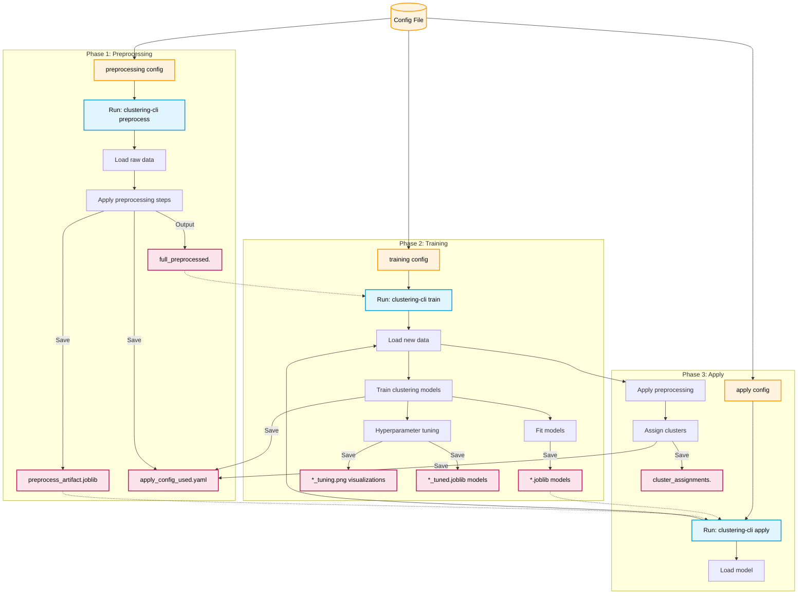

# Quick Start - Clustering CLI implementation

1. Environment
```bash
conda env create -f environment.yml
conda activate toolbox_env
# run in project root
pip install -e .
```

2. Commands
- Use default config
```bash
clustering-cli preprocess
clustering-cli train
clustering-cli apply
```
- Generate a config template
```bash
clustering-cli config-template
```

- Custom config usage
```bash
clustering-cli preprocess --config /path/to/config.yaml
clustering-cli train --config /path/to/config.yaml
clustering-cli apply --config /path/to/config.yaml
```

- Help
```bash
clustering-cli --help
```

3. Config Structure
```yaml
preprocessing:
  input:
    path: "Data/Raw/data.csv"    # Input data file path
    delimiter: ","              # CSV/TSV delimiter
    index_col: null             # Index column name (null to skip)
    drop_cols: []               # Columns to drop
  features:
    categorical: []             # List of categorical feature names
  imputation_method: "mean"     # "mean", "median", "knn", "mice", or "none"
  remove_zero_variance: true    # Remove features with zero variance
  missing_threshold: 50.0       # % threshold for removing high-missing features
  standardize: true             # Standardize numeric features
  standardize_binary: false     # If true, binary columns are also standardized
  output:
    directory: "Data/Processed" # Output folder for preprocess results
    format: "tsv"               # "csv", "tsv", or "parquet"
    save: true                  # Whether to write preprocess outputs to disk
    save_preprocess_artifact: true  # Save preprocessing artifact for future use
    preprocess_artifact_name: "preprocess_artifact"  # Artifact filename prefix
    save_config_snapshot: true  # Save preprocess_config_used.yaml in output directory
  logging:
    verbose: true               # Print preprocessing progress logs

training:
  input:
    source: "preprocessed"      # Currently only "preprocessed" is supported
    processed:
      directory: "Data/Processed"  # Folder for processed files
      format: "tsv"             # "csv", "tsv", or "parquet"
  random_state: 123             # Random seed for reproducibility
  already_standardized: true    # Set to false if data needs additional standardization
  logging:
    verbose: true               # Print training progress logs
  operations: ["fit", "tune"]   # "fit" and/or "tune"
  models: ["kmeans", "dbscan", "spectral"]  # Models to train
  model_params:                 # Default parameters for each model
    kmeans:
      n_clusters: 8
      init: "k-means++"
      n_init: 10
      max_iter: 300
      tol: 0.0001
      store_training_data: true
    dbscan:
      eps: 0.5
      min_samples: 5
      metric: "euclidean"
      store_training_data: true
    spectral:
      n_clusters: 8
      affinity: "rbf"
      n_neighbors: 10
      store_training_data: true
  tune_params:                  # Hyperparameter tuning configuration
    kmeans:
      n_clusters_range: [2, 10]  # Range of cluster numbers to try
      metric: "silhouette"      # "silhouette", "davies_bouldin", or "inertia"
    dbscan:
      eps_range: [0.1, 2.0]     # Range of eps values
      min_samples_range: [2, 20]  # Range of min_samples values
      metric: "silhouette"      # "silhouette" or "davies_bouldin"
    spectral:
      n_clusters_range: [2, 10]  # Range of cluster numbers
      affinity_options: ["rbf", "nearest_neighbors"]  # Affinity metrics to try
      n_neighbors_range: [5, 20]  # Range of n_neighbors (for nearest_neighbors)
      metric: "silhouette"      # "silhouette" or "davies_bouldin"
  output:
    directory: "Clustering-result"  # Output directory for training results
    save: true                    # Global write switch for training outputs
    save_config_snapshot: true    # Save train_config_used.yaml in output directory

apply:
  model_path: "Clustering-result/kmeans.joblib"  # Path to trained model
  input:
    path: "Data/Raw/new_data.csv"  # Input file for applying clustering
    delimiter: ","               # CSV/TSV delimiter
    index_col: null              # Index column name (null to skip)
    drop_cols: []                # Columns to drop
  preprocessing:
    use_artifact: true           # If true, apply saved preprocessing artifact
    artifact_path: null          # Optional artifact path (null = default)
  output:
    directory: "Clustering-result/apply"  # Output folder for apply results
    format: "tsv"                # "csv", "tsv", or "parquet"
    save: true                   # Whether to save results
    save_config_snapshot: true   # Save apply_config_used.yaml in output directory
  logging:
    verbose: true                # Print apply progress logs
    predict_proba: false         # Output probability if model supports it

unit_test:
  verbose: true                  # Enable verbose test output
```

4. Typical Workflows
```bash
# 1. Create environment
conda env create -f environment.yml

# 2. Activate environment
conda activate toolbox_env

# 3. Install package (run in project root)
pip install -e .

# 4. Run pipeline using default config (AI_toolbox/config/clustering_config.yaml)

clustering-cli preprocess
clustering-cli train
clustering-cli apply
```

## Check outputs
- Procesed data: Data/Processed by default
- Clustering results: Clustering-results/ by default
- Apply results: Clustering-results/apply/ by default

5. Notes for input data (Current implementation)
When training.input.source: preprocessed:
- Only full mode is supported for clustering (no train/test split needed):

The full_preprocessed file should contain all features to be used for clustering.

6. Usage logic


7. Unit Testing
This is used to verify whether clustering models are working correctly.

```bash
clustering-cli unit-test
```

This will run comprehensive tests on the clustering algorithms available at the moment (KMeans, DBSCAN, Spectral Clustering) with their respective outputs and visualization saved to the Data/Processed directory.

8. More notes for Clustering
- Unlike classification, clustering does not require a target variable.
- The preprocessing step is crucial for clustering, as it can significantly impact the results.
- The train command automatically evaluates clustering quality using metrics Sillhouette Score,  Davies-Bouldin Index, and Calinski-Harabasz Index and Inertia (Kmeans)
- The apply command assigns cluster labels to new data using a trained model
- Currently only KMeans, DBSCAN, and Spectral Clustering are supported with their corresponding visualizatons.