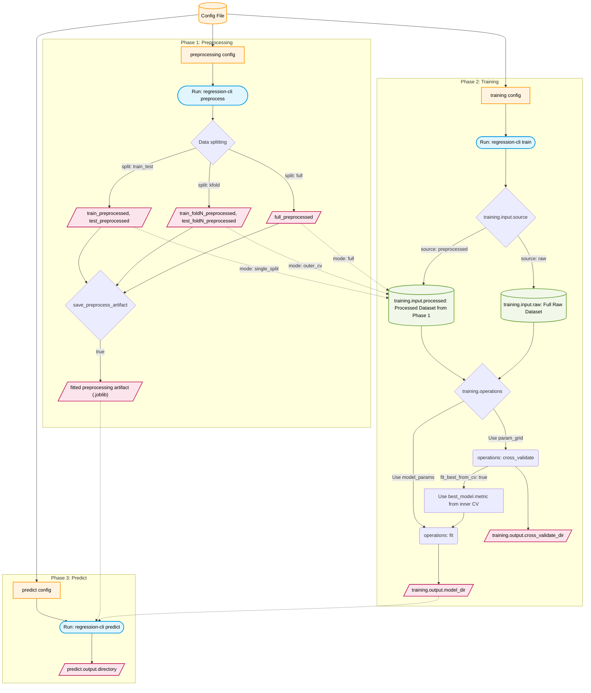

# Quick Start - Regression CLI

## 1. Environment

```bash
conda env create -f environment.yml
conda activate toolbox_env
# run in project root
pip install -e .
```

## 2. Commands

### A) Use default config (`AI_toolbox/config/regression_config.yaml`)

```bash
regression-cli preprocess
regression-cli train
regression-cli predict
```

### B) Generate a config template

```bash
regression-cli config-template
```

### C) Use a custom config

```bash
regression-cli preprocess --config /path/to/config.yaml
regression-cli train --config /path/to/config.yaml
regression-cli predict --config /path/to/config.yaml
```

### D) Help

```bash
regression-cli --help
```

## 3. Config Structure

```yaml
preprocessing:
  input:
    path: "/abs/path/input.csv"                 # input file path
    delimiter: ","                              # CSV/TSV delimiter
    index_col: "IID"                            # optional index column (null to skip)
    drop_cols: ["LLS"]                          # columns dropped before preprocessing
  target:
    column: "y"                                 # regression target column
  features:
    categorical: []                             # categorical columns for one-hot encoding

  imputation_method: "mice"                     # mean, median, knn, mice, none

  split:
    method: "kfold"                             # train_test, kfold, full
    train_test_ratio: 0.8                       # used only by train_test
    n_splits: 5                                 # used by kfold
    random_state: 42                            # split random seed

  output:
    directory: "/abs/path/output/Data/Processed" # preprocess output folder
    format: "tsv"                               # csv, tsv, parquet
    save: true                                  # whether to write preprocess outputs
    save_row_id: true                           # include __row_id__ for y recovery in training (when processed file doesn't include y)
    save_preprocess_artifact: true              # 建议 true：保存预处理 artifact，predict 时 use_artifact 才能复用同一套标准化/插补
    preprocess_artifact_name: "preprocess_artifact" # artifact 文件名前缀：<name>.joblib 或 <name>_foldN.joblib
    save_config_snapshot: true                  # save preprocess_config_used.yaml in output directory

  logging:
    verbose: true                               # print preprocessing progress

training:
  input:
    source: "preprocessed"                      # raw: use input.raw; preprocessed: use input.processed
    raw:
      path: "/abs/path/input.csv"               # used only when source=raw
      delimiter: ","                            # CSV/TSV delimiter for raw input
      index_col: "IID"                          # optional index column (null to skip)
      drop_cols: ["LLS"]                        # columns dropped before training
      target_column: "y"                        # regression target column in raw input
    processed:
      mode: "outer_cv"                          # single_split: train/test files; full: full_preprocessed; outer_cv: fold pairs
      directory: "/abs/path/output/Data/Processed" # processed data folder
      format: "tsv"                             # csv, tsv, parquet
      path: null                                # optional single processed file path (for mode=full/custom single file)

  random_state: 42                              # regressor random seed
  logging:
    verbose: true                               # wrapper verbosity during train

  operations: ["cross_validate", "fit"]         # cross_validate, fit
  models: ["ridge", "rf"]                       # models to run (must exist in SimpleRegressor registry)
  model_params: {}                              # used by fit
  param_grid:                                  # used by cross_validate (single values must be wrapped in lists)
    ridge:
      alpha: [0.1, 1.0, 10.0]
    rf:
      n_estimators: [200, 500]
      max_depth: [null, 10, 20]

  cv: 5                                         # inner CV folds for cross_validate
  scoring: {"r2": "r2", "rmse": "neg_root_mean_squared_error", "mae": "neg_mean_absolute_error"}  # str | list[str] | dict[name->metric]
  n_jobs: -1                                    # parallel jobs for CV
  rename_single_score: true                     # rename test_score -> test_<metric> for single string scoring

  fit_best_from_cv: true                        # refit best CV config for fit instead of model_params
  best_model:
    metric: "test_r2_mean"                      # ranking metric: <alias> | test_<alias> | test_<alias>_mean
    mode: "max"                                 # max or min

  output:
    cross_validate_dir: "/abs/path/Regression-result/cross_validate" # outputs for cross_validate
    model_dir: "/abs/path/Regression-result/model"                   # outputs for fit (.joblib)
    format: "tsv"                               # table format for CV outputs
    save: true                                  # global write switch for training outputs
    save_config_snapshot: true                  # save train_config_used.yaml in output directory

predict:
  model_path: "/abs/path/Regression-result/model/ridge.joblib"  # 须为 train 阶段 fit 保存的 .joblib
  input:
    path: "/abs/path/new_data.csv"
    delimiter: ","                              # TSV 用 "\t"
    index_col: "IID"
    drop_cols: ["y"]                            # 预测前删除目标列，避免泄露（若文件含真实值）
  preprocessing:
    use_artifact: true                          # 建议 true：对输入做与训练相同的标准化/插补，否则预测尺度会严重错误
    artifact_path: null                        # 可选；null 则从 preprocessing.output.directory 读 preprocess_artifact.joblib
  output:
    directory: "/abs/path/Regression-result/prediction"
    format: "tsv"
    save: true
    save_config_snapshot: true                  # save predict_config_used.yaml in output directory
  logging:
    verbose: true
```

## 4. Typical Workflows

```bash
# 1. Create environment
conda env create -f environment.yml

# 2. Activate environment
conda activate toolbox_env

# 3. Install package (run in project root)
pip install -e .

# 4. Run pipeline using default config (AI_toolbox/config/regression_config.yaml)
regression-cli preprocess
regression-cli train
regression-cli predict
```

### Check Outputs
- Processed data: `Data/Processed/` by default
- Regression results: `Regression-result/` by default（含 cross_validate、model、prediction）

### Predict 与预处理一致（必读）
- 训练时特征会做**标准化（及插补）**，模型是在标准化后的特征上拟合的。
- 预测时若 `predict.preprocessing.use_artifact: false`，输入不会做同样变换，预测值尺度会错误（如出现极大或负值）。
- **正确做法**：`preprocessing.output.save_preprocess_artifact: true`，跑完 preprocess 后再 train；predict 时设置 `predict.preprocessing.use_artifact: true`，这样会对预测输入做与训练相同的标准化/插补后再送入模型。

## 5. Notes for Input Data

### Validation Rules for Processed Files

When `training.input.source: preprocessed`:

- `single_split` requires both:
  - `train_preprocessed.<format>`
  - `test_preprocessed.<format>`

- `outer_cv` requires matched fold pairs:
  - `train_fold{n}_preprocessed.<format>`
  - `test_fold{n}_preprocessed.<format>`

- `full` expects a single full processed file:
  - `full_preprocessed.<format>`
  - or set `training.input.processed.path` explicitly

Fold IDs must match exactly between train and test files.

### outer_cv 与 fit
- `training.operations` 含 `fit` 且数据为 `outer_cv` 时，CLI 会**跳过 fit**（无单一训练集），仅做 cross_validate；若需保存模型用于 predict，请改用 `single_split`、`full` 或 `source: raw` 后重新 train。

## 6. Usage Logic


